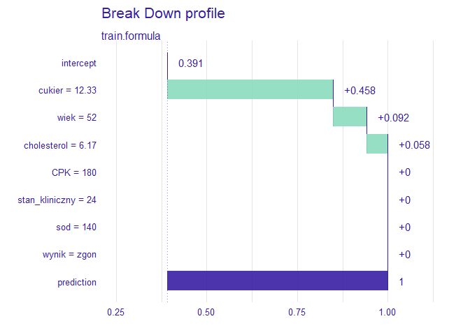

ML - udar - R
================
Łukasz Chuchra
29.05.2021

# 1. Cel projektu

Celem projektu jest zastosowanie oraz sprawdzenie skuteczności i
interpretowalności wybranych modeli ML. Do analizy wykorzystano zbior
danych pochodzacy z pliku “udar.csv”. Plik ten zawiera 7 zmiennych - 6
numerycznych zmiennych objasniajacych (wiek, cholesterol, CPK,
stan_kliniczny, sod, cukier) i 1 zmienna objaśnianą - wynik, przyjmujacą
wartość zgon lub stabilny

# 2. Odczyt danych

W projekcie użyto następujących bibliotek

``` r
library(iBreakDown)
library(openxlsx)
library(psych)
library(magrittr)
library(class)
library(ggplot2)
library(ggpubr)
library(plotly)
library(e1071)
library(MASS)
library(pROC)
library(caret)
library(dplyr)
library(DALEX)
library(gbm)
```

W projekcie użyto danych pochodzących z pliku udar.csv. Odczyt danych z
plików źródowych wyglądał następująco

``` r
dane <- read.csv(file.path(getwd(), "udar.csv"), sep=";", dec=".")
```

# 3. Oczyszczenie danych

Na początku sprawdzono podstawowe statystyki danych, żeby sprawdzić
jakie parametry przyjmują poszczególne zmienne, czy nie występują braki
danych, outliery i jakie związki zachodza pomiędzy zmiennymi.

``` r
describe(dane)
```

    ##                vars   n   mean    sd median trimmed   mad   min    max  range
    ## wynik*            1 560   1.39  0.49   1.00    1.37  0.00  1.00   2.00   1.00
    ## wiek              2 560  59.37  8.58  58.00   58.81  8.90 42.00  87.00  45.00
    ## cholesterol       3 560   6.11  1.01   6.15    6.18  0.59  2.70   8.73   6.03
    ## CPK               4 560 147.17 46.59 163.00  152.20 45.96 29.00 200.00 171.00
    ## stan_kliniczny    5 560  30.21 12.03  28.00   29.44 13.34  4.00  70.00  66.00
    ## sod               6 560 138.87  6.50 141.00  140.08  1.48 33.00 145.00 112.00
    ## cukier            7 560   9.59  4.15   8.45    9.03  2.96  3.32  24.90  21.58
    ##                 skew kurtosis   se
    ## wynik*          0.43    -1.82 0.02
    ## wiek            0.75     0.74 0.36
    ## cholesterol    -0.83     2.16 0.04
    ## CPK            -0.73    -0.59 1.97
    ## stan_kliniczny  0.47    -0.57 0.51
    ## sod            -8.84   126.62 0.27
    ## cukier          1.35     1.81 0.18

``` r
summary(dane)
```

    ##     wynik                wiek        cholesterol         CPK       
    ##  Length:560         Min.   :42.00   Min.   :2.700   Min.   : 29.0  
    ##  Class :character   1st Qu.:53.00   1st Qu.:5.817   1st Qu.:113.0  
    ##  Mode  :character   Median :58.00   Median :6.150   Median :163.0  
    ##                     Mean   :59.37   Mean   :6.105   Mean   :147.2  
    ##                     3rd Qu.:65.00   3rd Qu.:6.620   3rd Qu.:187.0  
    ##                     Max.   :87.00   Max.   :8.730   Max.   :200.0  
    ##  stan_kliniczny       sod            cukier      
    ##  Min.   : 4.00   Min.   : 33.0   Min.   : 3.320  
    ##  1st Qu.:21.00   1st Qu.:138.8   1st Qu.: 6.800  
    ##  Median :28.00   Median :141.0   Median : 8.450  
    ##  Mean   :30.21   Mean   :138.9   Mean   : 9.593  
    ##  3rd Qu.:39.00   3rd Qu.:142.0   3rd Qu.:11.450  
    ##  Max.   :70.00   Max.   :145.0   Max.   :24.900

Wsrod badanych zmiennych nie stwierdzono braków danych.

Aby móc zastosować w dalszej analizie modele ML tekstowa zmienna
objaniana należało zamienić na zmienna binarna, ktora dla parametru
“stabliny” przyjmowala wartosc 1, a dla parametru “zgon” przyjmowala
wartosc 0.

``` r
# dane$wynik <- as.factor(ifelse(dane$wynik == "stabilny", 1, 0))
dane$wynik <- as.factor(dane$wynik)
```

Poniżej zaprezentowano wyniki analizy poszczególnych zmiennych wraz z
wykresami pudełkowymi i histogramami

## 3.1 Wiek

``` r
ggplot(dane, aes(x = wiek, fill = wynik)) + geom_histogram(alpha = 0.6, bins = 25)
```

<!-- -->

``` r
ggplot(dane, aes(x = wynik, y = wiek, fill = wynik)) + geom_boxplot(alpha = 0.8)
```

<!-- -->

W przypadku wieku, że najwięcej badanych było w wieku około 60 lat.W
całym badaniu brały osoby w przedziale wiekowym od 42 do 87 lat. Warto
zaznaczyć, że rozkład zaprezentowany na wykresie pudełkowym różni się w
zależności, czy nastąpił zgon, czy pacjent ustablilizował się. W
przypadku zgonu mediana przesunięta jest na 55 lat zaś w przepadku
stabilizacji na 61 lat. Jest to nieintuicyjny wniosek, bo można zauwazyć
że w próbie wyższą śmiertelności zanotowano dla osób młodszych.

## 3.2 Cholesterol

``` r
ggplot(dane, aes(x = cholesterol, fill = wynik)) + geom_histogram(alpha = 0.6, bins = 25)
```

<!-- -->

``` r
ggplot(dane, aes(x = wynik, y = cholesterol, fill = wynik)) + geom_boxplot(alpha = 0.8)
```

<!-- -->

W przypadku cholesterolu średnia wartość wyniosła 6.105 mmol/l. Jeśli
chodzi o normę cholesterolu calkowitego to wynosi ona około 5.2 mmol/l,
co świadczy o tym, że w badaniu głównie brały udział osoby o
podwyższonej wartości cholesterolu we krwi. Warto również zaznaczyć, że
rozkłady dla pacjentów, którzy umarli oraz którzy przeżyli są podobne,
choć w przypadku śmierci można zauważyć większą liczbę odstających
niskich wartości zaś w przypadku przeżycia odnotowano większą liczbę
wysokich wartości odstających. Dane dla pacjentów, którzy przeżyli
charakteryzują się również większym rozrzutem.

## 3.3 CPK

``` r
ggplot(dane, aes(x = CPK, fill = wynik)) + geom_histogram(alpha = 0.6, bins = 25)
```

<!-- -->

``` r
ggplot(dane, aes(x = wynik, y = CPK, fill = wynik)) + geom_boxplot(alpha = 0.8)
```

<!-- -->

W przypadku CPK norma u człowieka wynosi 24-170 IU/l dla kobiet i 24-195
IU/l dla mężczyzn. Dla badanych danych średnia wartość wyniosła 147.3,
jednak warto zaznaczyć, że dane te nie zawierała informacji o płci
badanej osoby.

## 3.4 Stan kliniczny

``` r
ggplot(dane, aes(x = stan_kliniczny, fill = wynik)) + geom_histogram(alpha = 0.6, bins = 25)
```

<!-- -->

``` r
ggplot(dane, aes(x = wynik, y = stan_kliniczny, fill = wynik)) + geom_boxplot(alpha = 0.8)
```

<!-- -->

## 3.5 Sód

``` r
ggplot(dane, aes(x = sod, fill = wynik)) + geom_histogram(alpha = 0.6, bins = 25)
```

<!-- -->

``` r
ggplot(dane, aes(x = wynik, y = sod, fill = wynik)) + geom_boxplot(alpha = 0.8)
```

<!-- -->

W przypadku sodu prawidłowe zawartość w organizmie wynosi 135-145
mmol/l. Wśród badanych osób średnia wartość wyniosła 138.9 mmol/l. Można
również zauważyć, że rozkład sodu dla badanych osób jest bardzo podobno
zarówno w przypadku śmierci pacjenta jak i przeżycia.

## 3.6 Cukier

``` r
ggplot(dane, aes(x = cukier, fill = wynik)) + geom_histogram(alpha = 0.6, bins = 25)
```

<!-- -->

``` r
ggplot(dane, aes(x = wynik, y = cukier, fill = wynik)) + geom_boxplot(alpha = 0.8)
```

<!-- -->

Jak widać zawartość cukru znacząco wpływa na końcowy stan pacjenta
(śmierć lub przeżycie). Pacjenci, którzy przeżyli charakteryzowali się
znacznie niższą zawartością cukru we krwi.

## 3.7 Wynik (objaśniana zmienna)

``` r
barplot(table(dane$wynik))
```

<!-- -->

Można zauważyć, że dla zbioru danych odnotowano większą liczbę
przypadków przeżycia niż śmierci.

# 4. Podzial na zestaw testowy i uczacy

W dalszej części analizy zajęto się problemem doboru odpowiedniego
modelu ML do predykcji wartości zmiennej „wynik”. Pierwszym krokiem było
podzielenie zbioru z danymi na uczący i testowy w stosunku 70-30.

``` r
set.seed(1111)
los <- createDataPartition(dane$wynik, p=0.7, list=FALSE)
dane_uczace <- dane[los,]
dane_testowe <- dane[-los,]
```

Sprawdzono również, czy uzyskane losowanie daje rzeczywiście losowe
wartości w obydwu zbiorach. Jak widać poniżej zmienne charakteryzują się
podobnym rozkładem co świadczy o poprawności podziału.

``` r
summary(dane_testowe)
```

    ##       wynik          wiek        cholesterol         CPK        stan_kliniczny 
    ##  stabilny:101   Min.   :42.00   Min.   :2.900   Min.   : 29.0   Min.   : 5.00  
    ##  zgon    : 66   1st Qu.:53.00   1st Qu.:5.795   1st Qu.:123.0   1st Qu.:20.00  
    ##                 Median :58.00   Median :6.120   Median :167.0   Median :27.00  
    ##                 Mean   :59.68   Mean   :6.113   Mean   :150.8   Mean   :29.21  
    ##                 3rd Qu.:65.00   3rd Qu.:6.605   3rd Qu.:189.5   3rd Qu.:37.50  
    ##                 Max.   :87.00   Max.   :8.730   Max.   :200.0   Max.   :56.00  
    ##       sod            cukier      
    ##  Min.   : 33.0   Min.   : 3.320  
    ##  1st Qu.:139.0   1st Qu.: 6.850  
    ##  Median :141.0   Median : 8.600  
    ##  Mean   :138.9   Mean   : 9.614  
    ##  3rd Qu.:142.0   3rd Qu.:11.120  
    ##  Max.   :145.0   Max.   :24.700

``` r
summary(dane_uczace)
```

    ##       wynik          wiek        cholesterol         CPK        stan_kliniczny 
    ##  stabilny:238   Min.   :42.00   Min.   :2.700   Min.   : 29.0   Min.   : 4.00  
    ##  zgon    :155   1st Qu.:53.00   1st Qu.:5.840   1st Qu.:112.0   1st Qu.:21.00  
    ##                 Median :58.00   Median :6.170   Median :161.0   Median :28.00  
    ##                 Mean   :59.23   Mean   :6.102   Mean   :145.6   Mean   :30.63  
    ##                 3rd Qu.:64.00   3rd Qu.:6.620   3rd Qu.:187.0   3rd Qu.:40.00  
    ##                 Max.   :87.00   Max.   :8.730   Max.   :200.0   Max.   :70.00  
    ##       sod            cukier      
    ##  Min.   :106.0   Min.   : 3.570  
    ##  1st Qu.:138.0   1st Qu.: 6.800  
    ##  Median :141.0   Median : 8.400  
    ##  Mean   :138.9   Mean   : 9.584  
    ##  3rd Qu.:142.0   3rd Qu.:11.640  
    ##  Max.   :144.0   Max.   :24.900

Po podziale danych obydwie grupy charakteryzowały się podobnymi
rozkładami, co świadczy o poprawnym wydzieleniu danych uczących i
testowych.

Kolejnym krokiem bylo wyodrebnienie zbioru walidacyjnego. W tym celu
rowniez zastosowano funkcję z pakietu caret - trainControl.
Przygotowujac zbior walidacyjny zdecydowano na zastosowanie walidacji
krzyzowej, dla k=5 probek.

``` r
fit_control_acc <- trainControl(method = "cv", number = 5)
```

Utworzony obiekt fit_control_acc posłużył do tworzenia modeli dla
kryterium ACC. Do tworzenia modeli na podstawie kryterium ROC
zastosowano poniższy obiekt fit_control_roc

``` r
fit_control_roc <- trainControl(method = "cv", 
                                number = 5,
                                classProbs = TRUE,
                                summaryFunction = twoClassSummary)
```

# 5. Model KNN

Pierwszym z testowanych modeli ML byl model KNN.

## 5.1 Implementacja

Do generacji modelu KNN wykorzystano funkcję train(). Poniżej
przedstawiono implementację. Dla sprawdzenia modelu tuningowano parametr
k, czyli liczbę najbliższych sąsiadów.

### 5.1.1 Kryterium ACC

``` r
knn_acc <- train(wynik~.,
                  data=dane_uczace,
                  method = "knn",
                  preProc = c("center", "scale"),
                  trControl = fit_control_acc,
                  tuneGrid = expand.grid(k = 3:25))
knn_acc
```

    ## k-Nearest Neighbors 
    ## 
    ## 393 samples
    ##   6 predictor
    ##   2 classes: 'stabilny', 'zgon' 
    ## 
    ## Pre-processing: centered (6), scaled (6) 
    ## Resampling: Cross-Validated (5 fold) 
    ## Summary of sample sizes: 314, 314, 314, 315, 315 
    ## Resampling results across tuning parameters:
    ## 
    ##   k   Accuracy   Kappa    
    ##    3  0.8932489  0.7762150
    ##    4  0.8957806  0.7795766
    ##    5  0.8880558  0.7636939
    ##    6  0.8881207  0.7637415
    ##    7  0.8778643  0.7430101
    ##    8  0.8702045  0.7257444
    ##    9  0.8804933  0.7477958
    ##   10  0.8703019  0.7267583
    ##   11  0.8728335  0.7329941
    ##   12  0.8728335  0.7332815
    ##   13  0.8678027  0.7204602
    ##   14  0.8703343  0.7257979
    ##   15  0.8703343  0.7257979
    ##   16  0.8728660  0.7307151
    ##   17  0.8677702  0.7205672
    ##   18  0.8728660  0.7307325
    ##   19  0.8779292  0.7422558
    ##   20  0.8702694  0.7259274
    ##   21  0.8830250  0.7528174
    ##   22  0.8778643  0.7424728
    ##   23  0.8778968  0.7421062
    ##   24  0.8753327  0.7368576
    ##   25  0.8830250  0.7534288
    ## 
    ## Accuracy was used to select the optimal model using the largest value.
    ## The final value used for the model was k = 4.

Poniżej zaprezentowano wykres dokładności w zależności od liczby
najbliższych sąsiadów k dla kryterium ACC.

``` r
plot(knn_acc)
```

<!-- -->

Jak widać najwyższą dokładności uzyskano dla wartości k = 4. Dla tej
wartości k zbudowano model, dla którego poniżej przedstawiono macierz
pomyłek i dokładność modelu.

``` r
knn_acc_pred_ucz <- predict(knn_acc, dane_uczace)
knn_acc_tab_ucz <- table(knn_acc_pred_ucz, dane_uczace$wynik)
knn_acc_tab_ucz
```

    ##                 
    ## knn_acc_pred_ucz stabilny zgon
    ##         stabilny      226   10
    ##         zgon           12  145

``` r
sum(diag(knn_acc_tab_ucz)) / sum(knn_acc_tab_ucz)
```

    ## [1] 0.9440204

Stworzony model użyto również do predykcji danych testowych

``` r
knn_acc_pred_test <- predict(knn_acc, dane_testowe)
knn_acc_tab_test <- table(knn_acc_pred_test, dane_testowe$wynik)
knn_acc_tab_test
```

    ##                  
    ## knn_acc_pred_test stabilny zgon
    ##          stabilny       94   12
    ##          zgon            7   54

``` r
sum(diag(knn_acc_tab_test)) / sum(knn_acc_tab_test)
```

    ## [1] 0.8862275

Na koniec dla kryterium ACC sporządzono tabelę wpływu poszczególnych
zmiennych na zmienną objaśnianą

``` r
knn_acc_imp <- varImp(knn_acc)
knn_acc_imp
```

    ## ROC curve variable importance
    ## 
    ##                Importance
    ## cukier            100.000
    ## wiek               42.408
    ## CPK                30.419
    ## stan_kliniczny     12.088
    ## cholesterol         5.789
    ## sod                 0.000

### 5.1.2 Kryterium ROC

``` r
knn_roc <- train(wynik~.,
                 data=dane_uczace,
                 method = "knn",
                 preProc = c("center", "scale"),
                 trControl = fit_control_roc,
                 metric = "ROC",
                 tuneGrid = expand.grid(k = 3:25))
knn_roc
```

    ## k-Nearest Neighbors 
    ## 
    ## 393 samples
    ##   6 predictor
    ##   2 classes: 'stabilny', 'zgon' 
    ## 
    ## Pre-processing: centered (6), scaled (6) 
    ## Resampling: Cross-Validated (5 fold) 
    ## Summary of sample sizes: 315, 314, 315, 314, 314 
    ## Resampling results across tuning parameters:
    ## 
    ##   k   ROC        Sens       Spec     
    ##    3  0.9460507  0.9076241  0.8774194
    ##    4  0.9532072  0.9117908  0.8645161
    ##    5  0.9564159  0.9075355  0.8451613
    ##    6  0.9561042  0.9160461  0.8322581
    ##    7  0.9600992  0.9286348  0.8516129
    ##    8  0.9566103  0.9160461  0.8322581
    ##    9  0.9534775  0.9285461  0.8258065
    ##   10  0.9524694  0.9078014  0.7935484
    ##   11  0.9533402  0.9201241  0.8129032
    ##   12  0.9516544  0.9075355  0.8322581
    ##   13  0.9504461  0.8949468  0.8322581
    ##   14  0.9485858  0.8990248  0.8193548
    ##   15  0.9498098  0.9031915  0.8322581
    ##   16  0.9497383  0.9031915  0.8451613
    ##   17  0.9503489  0.9073582  0.8516129
    ##   18  0.9484000  0.8990248  0.8387097
    ##   19  0.9465726  0.9031028  0.8451613
    ##   20  0.9459534  0.9072695  0.8516129
    ##   21  0.9445879  0.9156028  0.8451613
    ##   22  0.9457547  0.8945922  0.8387097
    ##   23  0.9480754  0.8820922  0.8322581
    ##   24  0.9489262  0.8820922  0.8322581
    ##   25  0.9496754  0.8820922  0.8387097
    ## 
    ## ROC was used to select the optimal model using the largest value.
    ## The final value used for the model was k = 7.

Poniżej zaprezentowano wykres dokładności w zależności od liczby
najbliższych sąsiadów k dla kryterium acc.

``` r
plot(knn_roc)
```

<!-- -->

Jak widać najwyższą dokładności uzyskano dla wartości k = 7. Dla tej
wartości k zbudowano model, dla którego poniżej przedstawiono macierz
pomyłek i dokładność modelu.

``` r
knn_roc_pred_ucz <- predict(knn_roc, dane_uczace)
knn_roc_tab_ucz <- table(knn_roc_pred_ucz, dane_uczace$wynik)
knn_roc_tab_ucz
```

    ##                 
    ## knn_roc_pred_ucz stabilny zgon
    ##         stabilny      223   19
    ##         zgon           15  136

``` r
sum(diag(knn_roc_tab_ucz)) / sum(knn_roc_tab_ucz)
```

    ## [1] 0.913486

Stworzony model użyto również do predykcji danych testowych

``` r
knn_roc_pred_test <- predict(knn_roc, dane_testowe)
knn_roc_tab_test <- table(knn_roc_pred_test, dane_testowe$wynik)
knn_roc_tab_test
```

    ##                  
    ## knn_roc_pred_test stabilny zgon
    ##          stabilny       92   11
    ##          zgon            9   55

``` r
sum(diag(knn_roc_tab_test)) / sum(knn_roc_tab_test)
```

    ## [1] 0.8802395

Na koniec również dla kryterium ROC sporządzono tabelę wpływu
poszczególnych zmiennych na zmienną objaśnianą

``` r
knn_roc_imp <- varImp(knn_roc)
knn_roc_imp
```

    ## ROC curve variable importance
    ## 
    ##                Importance
    ## cukier            100.000
    ## wiek               42.408
    ## CPK                30.419
    ## stan_kliniczny     12.088
    ## cholesterol         5.789
    ## sod                 0.000

Porównując wyniki można zauwazyć, że dla obydwu kryteriów dokładność na
danych testowych jest niższa niż dla danych uczących (odpowiednio 0.8862
i 0.9440 dla ACC i 0.9134 i 0.8802 dla ROC). Dokładność ta jest
dodatkowo wyższa dla kryterium ACC, więc interpretowalność przedstawiono
dla modelu stworzonego, dla tego kryterium.

## 5.2 Interpretowalność

Kolejnym etapem było sprawdzenie interpretowalności wyników modelu KNN.
W tym celu posłużono się profilami Ceteris Paribus (PCP), wykresami
częściowej zależności (PDP) oraz oszacowano wartości SHAP.

### 5.2.1 PDP

PDP to przykład interpretowalności globalnej. W naszym przypadku dzięki
PDP będzie można określić jaki wpływ na wartość zmiennej objaśnianej ma
zmienna objaśniająca i jak może wpływać zmiana jej wartości.

``` r
knn_acc_exp<- explain(knn_acc, y=dane_uczace$wynik)
```

    ## Preparation of a new explainer is initiated
    ##   -> model label       :  train.formula  (  default  )
    ##   -> data              :  393  rows  7  cols  extracted from the model  
    ##   -> target variable   :  393  values 
    ##   -> predict function  :  yhat.train  will be used (  default  )
    ##   -> predicted values  :  No value for predict function target column. (  default  )
    ##   -> model_info        :  package caret , ver. 6.0.94 , task classification (  default  ) 
    ##   -> model_info        :  Model info detected classification task but 'y' is a factor .  (  WARNING  )
    ##   -> model_info        :  By deafult classification tasks supports only numercical 'y' parameter. 
    ##   -> model_info        :  Consider changing to numerical vector with 0 and 1 values.
    ##   -> model_info        :  Otherwise I will not be able to calculate residuals or loss function.
    ##   -> predicted values  :  numerical, min =  0 , mean =  0.3952926 , max =  1  
    ##   -> residual function :  difference between y and yhat (  default  )

    ##   -> residuals         :  numerical, min =  NA , mean =  NA , max =  NA  
    ##   A new explainer has been created!

``` r
pdp_knn <- variable_effect(explainer=knn_acc_exp,
                           variables = c("cukier", "wiek", "cholesterol",
                                         "CPK", "sod", "stan_kliniczny"))
plot(pdp_knn)
```

<!-- -->

Dla badanego modelu KNN wygenerowano wykres częściowej zależności PDP.
Wykres daje nam sporo informacji odnośnie tego co wpływa na
śmiertelność. Jak widać w przypadku wzrostu wartości cukru do 25
śmiertelność wynosi niemal 100%. Wartość cukru w tym przypadku jest
decydująca i ma największy wpływ na śmiertelność. Również wartość
cholestrolu wpływa w dużym spotpniu na przeżycie. W przypadku wysokiej
wartości cholesterolu (\>6mmol/l) śmiertelność wynosi 35-50% natomiast
dla wartości \<4mmol/l śmiertelność wynosi już mniej niż 20%. Ciekawe
wyniki uzyskano również dla sodu. Jego niska wartość \<110 mmol/l
skutkuje podwyższoną smiertelnością - powyżej 75%. Na koniec warto
również spojerzeć na wiek. Uzyskano ciekawe wyniki, gdyż najniższą
śmiertelnością w wyniku udaru charakteryzowały się osoby w wieku około
70 lat zaś najwyższą w wieku 50 lat i młodzsze. Zmienne CPK i stan
kliniczny utrzymywały zbliżone prawdopodobieństwo śmiertelności bez
względu na zmianę ich wartości.

### 5.2.2 PCP

PDP to przykład interpretowalności globalnej, ale o charakterze
modułowym. W naszym przypadku dzięki PCP będzie można określić
rokowania, dla konretnego pacjenta i zmiana jakich danych może
zmniejszyć ryzyko śmierci.Do interpretacji wybrano 2 pacjentów ze zbioru
danych.

``` r
pacjent_1 = dane[55,]
pcp_knn_1 <- predict_profile(explainer = knn_acc_exp,
                            variables = c("cukier", "wiek", "cholesterol",
                                          "CPK", "sod", "stan_kliniczny"),
                            new_observation = pacjent_1)
plot(pcp_knn_1)
```

<!-- -->

W powyższym przypadku pacjent zmarł, ale warto się zastanowić co mógł
zrobić, aby uniknąć śmierci. Z całą pewnością pacjent ten mógł polepszyć
swoją sytuację przez zmniejszenie niektórych parametrów. Ze wzwględu na
kombinację parametrów cholesterolu, cukru i stanu klinicznego nie miał
szansy na przeżycie, ale już zminiejszenie wartości cukru z ~13 do 7
spowodowałoby spadek ryzyka śmierci o 75%.Również przypadku cholesterolu
zmiana z 6mmol/l do 4.5mmol/l zmniejszyłaby w znacznym stopniu ryzyko
śmierci. W mniejszym stopniu na przeżycie mogłaby wpłynąć zawartośc
sodu. W przpadku pacjenta zmiana z 140 mmol/l do 120 ryzyko śmierci jest
niższe o 25%. Jak widać pacjent był w trudnej sytuacji - na tyle
trudnej, że na przeżycie nie wpłynęłaby zmiana wartości samego CPK.
Ryzyko smierci jest 100-procentowe bez względu na wartość tego
wskaźnika.

Przeanalizujmy jeszcze jeden przypadek pacjenta

``` r
pacjent_2 = dane[65,]
pcp_knn_2 <- predict_profile(explainer = knn_acc_exp,
                            variables = c("cukier", "wiek", "cholesterol",
                                          "CPK", "sod", "stan_kliniczny"),
                            new_observation = pacjent_2)
plot(pcp_knn_2)
```

<!-- -->

Również ten pacjent ma sporo do poprawy w swoim organizmie choć jego
sytuacja jest znacznie lepsza. Przede wszystkim ma znacznie niższą
wartość cukru, co w sporym stopniu zmniejsza ryzyko śmierci. W przypadku
zmniejszenia zawartości cukru we krwi śmiertelność dałoby się jeszcze
ograniczyć nawet do 25%. Na pewno zmniejszenie cholesterolu i sodu
również wpłynęłoby na przeżycie pacjenta. W przypadku zmiany
cholesterolu z ~6.1mmol/l do na przykłąd 5.6 mmol/l ryzyko jest niemal
zerowe. Znacznie lepiej wyglądałaby również sytuacja pacjenta, gdyby był
10 lat starszy, no ale na to nie ma oczywiście żadnego wpływu.

### 5.2.3 Shapley

Na koniec interpretacji wyników modelu KNN przygotowano również wartość
Shapleya dla powyższych dwóch pacjentów. Wartość Shapleya to z kolei
przykład interpretacji loklnej. Dzięki niej możemy odpowiedzieć, ktore
parametry wpłynęły na taki a nie inny status końcowy pacjenta w
porównaniu z innymi parametrami. Interpretujemy więc konkretnego
pacjenta.

``` r
shap_knn_1 <- local_attributions(knn_acc_exp, pacjent_1)
plot(shap_knn_1)
```

<!-- -->

Jak można odczytać w przypadku pacjenta 1 najbardziej na ryzyko śmierci
wpływa zawartość cukru, stan kliniczny, cholesterol. Wszystkie 3
wskaźniki zwiększają w jego przypadku ryzyko śmierci. Pacjent również
był w niekorzystnym wieku (z punktu widzenia dostania udaru). W
niewielkim stopniu na ryzyko śmierci wpłynęły sód oraz CPK (lekki spadek
ryzyka śmierci dla tej wartości), co potwierdziła również analiza PCP.

``` r
shap_knn_2 <- local_attributions(knn_acc_exp, pacjent_2)
plot(shap_knn_2)
```

<!-- -->

W przypadku pacjenta 2 na jego korzyść wpływa prawidłowa wartość cukru
we krwi, ale pacjent ten jest grupie podwyższonego ryzyka ze względu na
wiek, a na jego niekorzyść wpływają również wartości wskażników
cholesterol oraz sód. Niewielki wpływ na ryzyko śmierci ma CPK oraz stan
kliniczny - obydwie te wartości zmniejszają ryzyko śmierci.

# 6. Model Random Forest

Kolejnym z testowanych modeli ML byl algorytm random forest jako model
drzewa decyzyjnego.

## 6.1 Implementacja

Do generacji modelu random forest wykorzystano funkcję train(). Poniżej
przedstawiono implementację. Dla sprawdzenia modelu tuningowano
parametry mtry, splitrule oraz min.node.size. Jeśli chodzi o wartość
parametru mtry to jest to liczba wyników jaką losujemy z danych dla
danego drzewa (wartość ta ograniczona jest przez liczbę zmiennych
objaśniających. Wartość splitrule odpowiada za regułę na podstawie
której losoujemy wartości. Min.node.size odpowiada za minimalną liczbę
wygenerowanych drzew losowych.

### 6.1.1 Kryterium ACC

``` r
ranger_siatka <- expand.grid(mtry = c(1:6),
                             splitrule =c("gini","extratrees","hellinger"),
                             min.node.size = c(1:10))
ranger_acc <- train(wynik~.,
                 data=dane_uczace,
                 method = "ranger",
                 preProc = c("center", "scale"),
                 trControl = fit_control_acc,
                 tuneGrid = ranger_siatka)
ranger_acc
```

    ## Random Forest 
    ## 
    ## 393 samples
    ##   6 predictor
    ##   2 classes: 'stabilny', 'zgon' 
    ## 
    ## Pre-processing: centered (6), scaled (6) 
    ## Resampling: Cross-Validated (5 fold) 
    ## Summary of sample sizes: 314, 314, 315, 314, 315 
    ## Resampling results across tuning parameters:
    ## 
    ##   mtry  splitrule   min.node.size  Accuracy   Kappa    
    ##   1     gini         1             0.9260305  0.8439919
    ##   1     gini         2             0.9361895  0.8656500
    ##   1     gini         3             0.9336579  0.8603978
    ##   1     gini         4             0.9260305  0.8441179
    ##   1     gini         5             0.9260305  0.8441223
    ##   1     gini         6             0.9260954  0.8432054
    ##   1     gini         7             0.9260630  0.8433075
    ##   1     gini         8             0.9311263  0.8550202
    ##   1     gini         9             0.9286271  0.8486696
    ##   1     gini        10             0.9311587  0.8543272
    ##   1     extratrees   1             0.9388186  0.8705914
    ##   1     extratrees   2             0.9387212  0.8706387
    ##   1     extratrees   3             0.9362220  0.8653274
    ##   1     extratrees   4             0.9336579  0.8592854
    ##   1     extratrees   5             0.9285622  0.8489749
    ##   1     extratrees   6             0.9260305  0.8433313
    ##   1     extratrees   7             0.9260305  0.8432664
    ##   1     extratrees   8             0.9260630  0.8428962
    ##   1     extratrees   9             0.9209997  0.8325216
    ##   1     extratrees  10             0.9286271  0.8487166
    ##   1     hellinger    1             0.9234989  0.8385880
    ##   1     hellinger    2             0.9336254  0.8606396
    ##   1     hellinger    3             0.9310613  0.8556589
    ##   1     hellinger    4             0.9285622  0.8497109
    ##   1     hellinger    5             0.9260305  0.8444355
    ##   1     hellinger    6             0.9285622  0.8499621
    ##   1     hellinger    7             0.9260305  0.8441843
    ##   1     hellinger    8             0.9310938  0.8552389
    ##   1     hellinger    9             0.9184356  0.8276608
    ##   1     hellinger   10             0.9260305  0.8444355
    ##   2     gini         1             0.9387537  0.8715784
    ##   2     gini         2             0.9387537  0.8715784
    ##   2     gini         3             0.9336579  0.8604881
    ##   2     gini         4             0.9362220  0.8660504
    ##   2     gini         5             0.9311263  0.8553379
    ##   2     gini         6             0.9285946  0.8498113
    ##   2     gini         7             0.9286271  0.8493968
    ##   2     gini         8             0.9235313  0.8383703
    ##   2     gini         9             0.9285946  0.8494937
    ##   2     gini        10             0.9286271  0.8489376
    ##   2     extratrees   1             0.9413178  0.8770804
    ##   2     extratrees   2             0.9438169  0.8826822
    ##   2     extratrees   3             0.9464135  0.8877033
    ##   2     extratrees   4             0.9413178  0.8774467
    ##   2     extratrees   5             0.9387537  0.8718802
    ##   2     extratrees   6             0.9362545  0.8666465
    ##   2     extratrees   7             0.9388186  0.8717363
    ##   2     extratrees   8             0.9362869  0.8660608
    ##   2     extratrees   9             0.9337553  0.8599177
    ##   2     extratrees  10             0.9261279  0.8436670
    ##   2     hellinger    1             0.9285622  0.8504799
    ##   2     hellinger    2             0.9310938  0.8559430
    ##   2     hellinger    3             0.9285622  0.8504799
    ##   2     hellinger    4             0.9285622  0.8502287
    ##   2     hellinger    5             0.9285622  0.8498986
    ##   2     hellinger    6             0.9259981  0.8449179
    ##   2     hellinger    7             0.9234664  0.8394548
    ##   2     hellinger    8             0.9285946  0.8500599
    ##   2     hellinger    9             0.9260630  0.8445334
    ##   2     hellinger   10             0.9234989  0.8395527
    ##   3     gini         1             0.9336579  0.8604881
    ##   3     gini         2             0.9361895  0.8660161
    ##   3     gini         3             0.9362220  0.8660504
    ##   3     gini         4             0.9336579  0.8606147
    ##   3     gini         5             0.9286271  0.8493968
    ##   3     gini         6             0.9311587  0.8550560
    ##   3     gini         7             0.9260630  0.8442201
    ##   3     gini         8             0.9311587  0.8550560
    ##   3     gini         9             0.9235313  0.8382433
    ##   3     gini        10             0.9235313  0.8386290
    ##   3     extratrees   1             0.9438494  0.8826577
    ##   3     extratrees   2             0.9387537  0.8720640
    ##   3     extratrees   3             0.9413178  0.8773809
    ##   3     extratrees   4             0.9413178  0.8775653
    ##   3     extratrees   5             0.9311587  0.8552994
    ##   3     extratrees   6             0.9311587  0.8560443
    ##   3     extratrees   7             0.9311587  0.8548464
    ##   3     extratrees   8             0.9209997  0.8338512
    ##   3     extratrees   9             0.9311587  0.8548464
    ##   3     extratrees  10             0.9260954  0.8437911
    ##   3     hellinger    1             0.9336254  0.8612209
    ##   3     hellinger    2             0.9336579  0.8615053
    ##   3     hellinger    3             0.9310938  0.8559430
    ##   3     hellinger    4             0.9311263  0.8560422
    ##   3     hellinger    5             0.9336579  0.8615053
    ##   3     hellinger    6             0.9311263  0.8561047
    ##   3     hellinger    7             0.9260305  0.8450793
    ##   3     hellinger    8             0.9285946  0.8506416
    ##   3     hellinger    9             0.9260305  0.8450793
    ##   3     hellinger   10             0.9285946  0.8506416
    ##   4     gini         1             0.9311263  0.8548950
    ##   4     gini         2             0.9285946  0.8493038
    ##   4     gini         3             0.9285946  0.8493038
    ##   4     gini         4             0.9286271  0.8497825
    ##   4     gini         5             0.9235313  0.8382433
    ##   4     gini         6             0.9235313  0.8382433
    ##   4     gini         7             0.9235313  0.8385632
    ##   4     gini         8             0.9260630  0.8438345
    ##   4     gini         9             0.9285946  0.8487795
    ##   4     gini        10             0.9260630  0.8440898
    ##   4     extratrees   1             0.9311263  0.8559069
    ##   4     extratrees   2             0.9362545  0.8666399
    ##   4     extratrees   3             0.9311263  0.8560920
    ##   4     extratrees   4             0.9336904  0.8604478
    ##   4     extratrees   5             0.9234989  0.8392395
    ##   4     extratrees   6             0.9184356  0.8281841
    ##   4     extratrees   7             0.9235313  0.8387560
    ##   4     extratrees   8             0.9209997  0.8339984
    ##   4     extratrees   9             0.9235638  0.8380071
    ##   4     extratrees  10             0.9109056  0.8103694
    ##   4     hellinger    1             0.9362220  0.8664860
    ##   4     hellinger    2             0.9362220  0.8664860
    ##   4     hellinger    3             0.9362220  0.8664860
    ##   4     hellinger    4             0.9362220  0.8664860
    ##   4     hellinger    5             0.9336904  0.8610853
    ##   4     hellinger    6             0.9336904  0.8610853
    ##   4     hellinger    7             0.9336904  0.8610853
    ##   4     hellinger    8             0.9336904  0.8610853
    ##   4     hellinger    9             0.9311587  0.8556223
    ##   4     hellinger   10             0.9311587  0.8556223
    ##   5     gini         1             0.9311263  0.8548950
    ##   5     gini         2             0.9285946  0.8493038
    ##   5     gini         3             0.9311587  0.8543389
    ##   5     gini         4             0.9285946  0.8492358
    ##   5     gini         5             0.9235313  0.8382433
    ##   5     gini         6             0.9235313  0.8385565
    ##   5     gini         7             0.9235313  0.8382433
    ##   5     gini         8             0.9260630  0.8438345
    ##   5     gini         9             0.9286271  0.8491248
    ##   5     gini        10             0.9285946  0.8487795
    ##   5     extratrees   1             0.9311912  0.8554623
    ##   5     extratrees   2             0.9336904  0.8612180
    ##   5     extratrees   3             0.9337228  0.8604019
    ##   5     extratrees   4             0.9260954  0.8446855
    ##   5     extratrees   5             0.9209997  0.8341128
    ##   5     extratrees   6             0.9210321  0.8328135
    ##   5     extratrees   7             0.9159364  0.8222982
    ##   5     extratrees   8             0.9184680  0.8271222
    ##   5     extratrees   9             0.9159688  0.8222036
    ##   5     extratrees  10             0.9108731  0.8103351
    ##   5     hellinger    1             0.9362220  0.8664860
    ##   5     hellinger    2             0.9362220  0.8664860
    ##   5     hellinger    3             0.9362220  0.8664860
    ##   5     hellinger    4             0.9362220  0.8664860
    ##   5     hellinger    5             0.9362220  0.8664860
    ##   5     hellinger    6             0.9286271  0.8504060
    ##   5     hellinger    7             0.9311587  0.8558677
    ##   5     hellinger    8             0.9336904  0.8610853
    ##   5     hellinger    9             0.9311587  0.8558677
    ##   5     hellinger   10             0.9311587  0.8556223
    ##   6     gini         1             0.9286271  0.8479852
    ##   6     gini         2             0.9337228  0.8597418
    ##   6     gini         3             0.9362869  0.8648884
    ##   6     gini         4             0.9261279  0.8430908
    ##   6     gini         5             0.9260954  0.8435916
    ##   6     gini         6             0.9286595  0.8483687
    ##   6     gini         7             0.9159688  0.8208192
    ##   6     gini         8             0.9235313  0.8379750
    ##   6     gini         9             0.9260630  0.8432530
    ##   6     gini        10             0.9210321  0.8322000
    ##   6     extratrees   1             0.9337228  0.8609264
    ##   6     extratrees   2             0.9285946  0.8503803
    ##   6     extratrees   3             0.9311912  0.8554623
    ##   6     extratrees   4             0.9184680  0.8285847
    ##   6     extratrees   5             0.9209997  0.8338096
    ##   6     extratrees   6             0.9235638  0.8383415
    ##   6     extratrees   7             0.9185005  0.8283629
    ##   6     extratrees   8             0.9159364  0.8219799
    ##   6     extratrees   9             0.9109056  0.8105684
    ##   6     extratrees  10             0.9108731  0.8106630
    ##   6     hellinger    1             0.9362545  0.8663034
    ##   6     hellinger    2             0.9387861  0.8715210
    ##   6     hellinger    3             0.9387861  0.8715210
    ##   6     hellinger    4             0.9362220  0.8664860
    ##   6     hellinger    5             0.9387861  0.8715210
    ##   6     hellinger    6             0.9362220  0.8664860
    ##   6     hellinger    7             0.9336904  0.8610853
    ##   6     hellinger    8             0.9336904  0.8610853
    ##   6     hellinger    9             0.9336904  0.8610853
    ##   6     hellinger   10             0.9311587  0.8556223
    ## 
    ## Accuracy was used to select the optimal model using the largest value.
    ## The final values used for the model were mtry = 2, splitrule = extratrees
    ##  and min.node.size = 3.

Poniżej zaprezentowano wykres dokładności w zależności od wartości
parametrów mtry, splitrule i min.node.size dla kryterium ACC.

``` r
plot(ranger_acc)
```

<!-- -->

Jak widać najwyższą dokładności uzyskano dla wartości mtry = 1,
splitrule = extratrees i min.node.size = 2. Dla tych wartości zbudowano
model, dla którego poniżej przedstawiono macierz pomyłek i dokładność
modelu.

``` r
ranger_acc_pred_ucz <- predict(ranger_acc, dane_uczace)
ranger_acc_tab_ucz <- table(ranger_acc_pred_ucz, dane_uczace$wynik)
ranger_acc_tab_ucz
```

    ##                    
    ## ranger_acc_pred_ucz stabilny zgon
    ##            stabilny      238    0
    ##            zgon            0  155

``` r
sum(diag(ranger_acc_tab_ucz)) / sum(ranger_acc_tab_ucz)
```

    ## [1] 1

Stworzony model użyto również do predykcji danych testowych

``` r
ranger_acc_pred_test <- predict(ranger_acc, dane_testowe)
ranger_acc_tab_test <- table(ranger_acc_pred_test, dane_testowe$wynik)
ranger_acc_tab_test
```

    ##                     
    ## ranger_acc_pred_test stabilny zgon
    ##             stabilny       98   11
    ##             zgon            3   55

``` r
sum(diag(ranger_acc_tab_test)) / sum(ranger_acc_tab_test)
```

    ## [1] 0.9161677

<!-- Na koniec dla kryterium ACC sporządzono tabelę wpływu poszczególnych zmiennych na zmienną objaśnianą -->
<!-- # ```{r} -->
<!-- # ranger_acc_imp <- varImp(ranger_acc) -->
<!-- # ranger_acc_imp -->
<!-- # ``` -->

### 6.1.2 Kryterium ROC

``` r
ranger_roc <- train(wynik~.,
                 data=dane_uczace,
                 method = "ranger",
                 preProc = c("center", "scale"),
                 trControl = fit_control_roc,
                 metric = "ROC",
                 tuneGrid = ranger_siatka)
ranger_roc
```

    ## Random Forest 
    ## 
    ## 393 samples
    ##   6 predictor
    ##   2 classes: 'stabilny', 'zgon' 
    ## 
    ## Pre-processing: centered (6), scaled (6) 
    ## Resampling: Cross-Validated (5 fold) 
    ## Summary of sample sizes: 314, 315, 314, 314, 315 
    ## Resampling results across tuning parameters:
    ## 
    ##   mtry  splitrule   min.node.size  ROC        Sens       Spec     
    ##   1     gini         1             0.9849434  0.9578014  0.9290323
    ##   1     gini         2             0.9864162  0.9578014  0.9290323
    ##   1     gini         3             0.9850663  0.9578014  0.9161290
    ##   1     gini         4             0.9841198  0.9620567  0.9290323
    ##   1     gini         5             0.9852065  0.9620567  0.9096774
    ##   1     gini         6             0.9854696  0.9578014  0.8967742
    ##   1     gini         7             0.9847947  0.9578014  0.8967742
    ##   1     gini         8             0.9831532  0.9578014  0.8967742
    ##   1     gini         9             0.9838367  0.9578014  0.8838710
    ##   1     gini        10             0.9818034  0.9578014  0.8838710
    ##   1     extratrees   1             0.9898164  0.9703901  0.9483871
    ##   1     extratrees   2             0.9902253  0.9703901  0.9548387
    ##   1     extratrees   3             0.9881892  0.9662234  0.9419355
    ##   1     extratrees   4             0.9864276  0.9578014  0.9096774
    ##   1     extratrees   5             0.9839568  0.9536348  0.8967742
    ##   1     extratrees   6             0.9839510  0.9661348  0.8967742
    ##   1     extratrees   7             0.9831446  0.9578014  0.8967742
    ##   1     extratrees   8             0.9808453  0.9578014  0.8645161
    ##   1     extratrees   9             0.9812571  0.9661348  0.8774194
    ##   1     extratrees  10             0.9800217  0.9619681  0.8838710
    ##   1     hellinger    1             0.9852122  0.9620567  0.9032258
    ##   1     hellinger    2             0.9842656  0.9620567  0.9096774
    ##   1     hellinger    3             0.9846803  0.9620567  0.9032258
    ##   1     hellinger    4             0.9837251  0.9620567  0.8967742
    ##   1     hellinger    5             0.9834420  0.9620567  0.8967742
    ##   1     hellinger    6             0.9831732  0.9620567  0.8903226
    ##   1     hellinger    7             0.9835707  0.9620567  0.8903226
    ##   1     hellinger    8             0.9820750  0.9620567  0.8903226
    ##   1     hellinger    9             0.9830245  0.9620567  0.8838710
    ##   1     hellinger   10             0.9816690  0.9620567  0.8838710
    ##   2     gini         1             0.9871254  0.9620567  0.9096774
    ##   2     gini         2             0.9847232  0.9620567  0.9096774
    ##   2     gini         3             0.9852151  0.9578014  0.9096774
    ##   2     gini         4             0.9856240  0.9620567  0.9096774
    ##   2     gini         5             0.9849434  0.9578014  0.8967742
    ##   2     gini         6             0.9845259  0.9578901  0.8903226
    ##   2     gini         7             0.9830188  0.9536348  0.8903226
    ##   2     gini         8             0.9839796  0.9578901  0.8838710
    ##   2     gini         9             0.9830245  0.9620567  0.8903226
    ##   2     gini        10             0.9828872  0.9578901  0.8903226
    ##   2     extratrees   1             0.9858027  0.9536348  0.9290323
    ##   2     extratrees   2             0.9862260  0.9494681  0.9354839
    ##   2     extratrees   3             0.9864305  0.9453014  0.9290323
    ##   2     extratrees   4             0.9854667  0.9661348  0.9225806
    ##   2     extratrees   5             0.9846431  0.9661348  0.9032258
    ##   2     extratrees   6             0.9837022  0.9619681  0.9032258
    ##   2     extratrees   7             0.9839596  0.9661348  0.9096774
    ##   2     extratrees   8             0.9816575  0.9536348  0.8967742
    ##   2     extratrees   9             0.9811199  0.9619681  0.8838710
    ##   2     extratrees  10             0.9807138  0.9619681  0.8838710
    ##   2     hellinger    1             0.9838066  0.9620567  0.9096774
    ##   2     hellinger    2             0.9825154  0.9620567  0.9032258
    ##   2     hellinger    3             0.9831875  0.9620567  0.9032258
    ##   2     hellinger    4             0.9827871  0.9578901  0.9096774
    ##   2     hellinger    5             0.9826470  0.9620567  0.9096774
    ##   2     hellinger    6             0.9822523  0.9578901  0.8838710
    ##   2     hellinger    7             0.9817033  0.9620567  0.8903226
    ##   2     hellinger    8             0.9813000  0.9620567  0.8838710
    ##   2     hellinger    9             0.9800675  0.9578901  0.8967742
    ##   2     hellinger   10             0.9814287  0.9578901  0.8709677
    ##   3     gini         1             0.9864934  0.9578901  0.9096774
    ##   3     gini         2             0.9850721  0.9620567  0.9096774
    ##   3     gini         3             0.9849319  0.9537234  0.9096774
    ##   3     gini         4             0.9845287  0.9578901  0.9032258
    ##   3     gini         5             0.9837080  0.9537234  0.8967742
    ##   3     gini         6             0.9834420  0.9578901  0.8838710
    ##   3     gini         7             0.9818091  0.9578901  0.8838710
    ##   3     gini         8             0.9826155  0.9537234  0.8838710
    ##   3     gini         9             0.9828872  0.9494681  0.8774194
    ##   3     gini        10             0.9822094  0.9537234  0.8903226
    ##   3     extratrees   1             0.9850692  0.9536348  0.9290323
    ##   3     extratrees   2             0.9863604  0.9494681  0.9225806
    ##   3     extratrees   3             0.9845344  0.9578014  0.9225806
    ##   3     extratrees   4             0.9838481  0.9536348  0.9161290
    ##   3     extratrees   5             0.9843800  0.9578014  0.9096774
    ##   3     extratrees   6             0.9823582  0.9578014  0.9096774
    ##   3     extratrees   7             0.9807224  0.9619681  0.8967742
    ##   3     extratrees   8             0.9822152  0.9494681  0.8903226
    ##   3     extratrees   9             0.9804593  0.9494681  0.8774194
    ##   3     extratrees  10             0.9805737  0.9536348  0.8838710
    ##   3     hellinger    1             0.9831346  0.9536348  0.9096774
    ##   3     hellinger    2             0.9823868  0.9537234  0.9096774
    ##   3     hellinger    3             0.9823810  0.9537234  0.9096774
    ##   3     hellinger    4             0.9819749  0.9537234  0.9032258
    ##   3     hellinger    5             0.9806366  0.9537234  0.9096774
    ##   3     hellinger    6             0.9810255  0.9537234  0.8903226
    ##   3     hellinger    7             0.9803620  0.9495567  0.8967742
    ##   3     hellinger    8             0.9807596  0.9578901  0.8967742
    ##   3     hellinger    9             0.9808997  0.9495567  0.9096774
    ##   3     hellinger   10             0.9794069  0.9578901  0.8967742
    ##   4     gini         1             0.9852851  0.9537234  0.9225806
    ##   4     gini         2             0.9849434  0.9579787  0.9225806
    ##   4     gini         3             0.9839796  0.9537234  0.9161290
    ##   4     gini         4             0.9827528  0.9537234  0.9096774
    ##   4     gini         5             0.9823639  0.9537234  0.8967742
    ##   4     gini         6             0.9818091  0.9537234  0.8838710
    ##   4     gini         7             0.9822123  0.9537234  0.8838710
    ##   4     gini         8             0.9816632  0.9537234  0.8838710
    ##   4     gini         9             0.9812514  0.9537234  0.8903226
    ##   4     gini        10             0.9815374  0.9537234  0.8903226
    ##   4     extratrees   1             0.9865034  0.9536348  0.9225806
    ##   4     extratrees   2             0.9854667  0.9536348  0.9225806
    ##   4     extratrees   3             0.9861588  0.9536348  0.9161290
    ##   4     extratrees   4             0.9838424  0.9536348  0.8967742
    ##   4     extratrees   5             0.9838538  0.9578014  0.8903226
    ##   4     extratrees   6             0.9824868  0.9494681  0.8903226
    ##   4     extratrees   7             0.9824954  0.9536348  0.8903226
    ##   4     extratrees   8             0.9818119  0.9578014  0.8774194
    ##   4     extratrees   9             0.9815403  0.9536348  0.8709677
    ##   4     extratrees  10             0.9804478  0.9536348  0.8709677
    ##   4     hellinger    1             0.9803706  0.9453901  0.9096774
    ##   4     hellinger    2             0.9812471  0.9537234  0.8967742
    ##   4     hellinger    3             0.9817261  0.9453014  0.9096774
    ##   4     hellinger    4             0.9811828  0.9453901  0.9032258
    ##   4     hellinger    5             0.9802391  0.9453901  0.9096774
    ##   4     hellinger    6             0.9799703  0.9494681  0.9032258
    ##   4     hellinger    7             0.9787434  0.9411348  0.9032258
    ##   4     hellinger    8             0.9782029  0.9411348  0.8903226
    ##   4     hellinger    9             0.9786062  0.9453014  0.8903226
    ##   4     hellinger   10             0.9783259  0.9369681  0.8903226
    ##   5     gini         1             0.9842742  0.9622340  0.9096774
    ##   5     gini         2             0.9841312  0.9579787  0.9096774
    ##   5     gini         3             0.9823696  0.9579787  0.9032258
    ##   5     gini         4             0.9832533  0.9579787  0.8967742
    ##   5     gini         5             0.9830416  0.9579787  0.8967742
    ##   5     gini         6             0.9823639  0.9579787  0.9032258
    ##   5     gini         7             0.9815460  0.9494681  0.8774194
    ##   5     gini         8             0.9811285  0.9494681  0.8967742
    ##   5     gini         9             0.9805908  0.9537234  0.8838710
    ##   5     gini        10             0.9811456  0.9537234  0.8838710
    ##   5     extratrees   1             0.9860301  0.9578014  0.9032258
    ##   5     extratrees   2             0.9864333  0.9578901  0.9032258
    ##   5     extratrees   3             0.9849348  0.9536348  0.9032258
    ##   5     extratrees   4             0.9846660  0.9494681  0.8967742
    ##   5     extratrees   5             0.9835821  0.9536348  0.8774194
    ##   5     extratrees   6             0.9834534  0.9536348  0.8709677
    ##   5     extratrees   7             0.9826298  0.9494681  0.8580645
    ##   5     extratrees   8             0.9826298  0.9536348  0.8645161
    ##   5     extratrees   9             0.9814059  0.9494681  0.8580645
    ##   5     extratrees  10             0.9800589  0.9494681  0.8645161
    ##   5     hellinger    1             0.9787549  0.9412234  0.9096774
    ##   5     hellinger    2             0.9802462  0.9495567  0.9096774
    ##   5     hellinger    3             0.9803120  0.9411348  0.9032258
    ##   5     hellinger    4             0.9794069  0.9495567  0.9096774
    ##   5     hellinger    5             0.9782001  0.9412234  0.9096774
    ##   5     hellinger    6             0.9791524  0.9453901  0.9032258
    ##   5     hellinger    7             0.9786062  0.9411348  0.9096774
    ##   5     hellinger    8             0.9783402  0.9411348  0.8838710
    ##   5     hellinger    9             0.9776510  0.9453014  0.9032258
    ##   5     hellinger   10             0.9781972  0.9369681  0.9032258
    ##   6     gini         1             0.9837337  0.9579787  0.9161290
    ##   6     gini         2             0.9827871  0.9622340  0.9096774
    ##   6     gini         3             0.9821008  0.9622340  0.9096774
    ##   6     gini         4             0.9817004  0.9579787  0.8967742
    ##   6     gini         5             0.9814144  0.9537234  0.8838710
    ##   6     gini         6             0.9811456  0.9537234  0.8903226
    ##   6     gini         7             0.9797729  0.9537234  0.8838710
    ##   6     gini         8             0.9789608  0.9494681  0.8709677
    ##   6     gini         9             0.9797787  0.9494681  0.8903226
    ##   6     gini        10             0.9789722  0.9537234  0.8774194
    ##   6     extratrees   1             0.9864333  0.9536348  0.9032258
    ##   6     extratrees   2             0.9856269  0.9494681  0.8967742
    ##   6     extratrees   3             0.9852122  0.9536348  0.8967742
    ##   6     extratrees   4             0.9835879  0.9452128  0.8903226
    ##   6     extratrees   5             0.9834506  0.9537234  0.8774194
    ##   6     extratrees   6             0.9837165  0.9536348  0.8709677
    ##   6     extratrees   7             0.9820922  0.9536348  0.8645161
    ##   6     extratrees   8             0.9818205  0.9494681  0.8645161
    ##   6     extratrees   9             0.9811456  0.9536348  0.8580645
    ##   6     extratrees  10             0.9804736  0.9494681  0.8580645
    ##   6     hellinger    1             0.9788921  0.9495567  0.9032258
    ##   6     hellinger    2             0.9805851  0.9453901  0.9096774
    ##   6     hellinger    3             0.9790351  0.9495567  0.9032258
    ##   6     hellinger    4             0.9787520  0.9411348  0.9096774
    ##   6     hellinger    5             0.9791466  0.9368794  0.9032258
    ##   6     hellinger    6             0.9769761  0.9369681  0.9032258
    ##   6     hellinger    7             0.9778026  0.9453901  0.9161290
    ##   6     hellinger    8             0.9787491  0.9412234  0.9096774
    ##   6     hellinger    9             0.9781972  0.9412234  0.9032258
    ##   6     hellinger   10             0.9790180  0.9412234  0.8967742
    ## 
    ## ROC was used to select the optimal model using the largest value.
    ## The final values used for the model were mtry = 1, splitrule = extratrees
    ##  and min.node.size = 2.

Poniżej zaprezentowano wykres dokładności w zależności od wartości
parametrów mtry, splitrule i min.node.size dla kryterium ROC.

``` r
plot(ranger_roc)
```

<!-- -->

Jak widać najwyższą dokładności uzyskano dla wartości mtry = 1,
splitrule = extratrees i min.node.size = 1. Dla tych wartości zbudowano
model, dla którego poniżej przedstawiono macierz pomyłek i dokładność
modelu.

``` r
ranger_roc_pred_ucz <- predict(ranger_roc, dane_uczace)
ranger_roc_tab_ucz <- table(ranger_roc_pred_ucz, dane_uczace$wynik)
ranger_roc_tab_ucz
```

    ##                    
    ## ranger_roc_pred_ucz stabilny zgon
    ##            stabilny      238    0
    ##            zgon            0  155

``` r
sum(diag(ranger_roc_tab_ucz)) / sum(ranger_roc_tab_ucz)
```

    ## [1] 1

Stworzony model użyto również do predykcji danych testowych

``` r
ranger_roc_pred_test <- predict(ranger_roc, dane_testowe)
ranger_roc_tab_test <- table(ranger_roc_pred_test, dane_testowe$wynik)
ranger_roc_tab_test
```

    ##                     
    ## ranger_roc_pred_test stabilny zgon
    ##             stabilny      100   10
    ##             zgon            1   56

``` r
sum(diag(ranger_roc_tab_test)) / sum(ranger_roc_tab_test)
```

    ## [1] 0.9341317

<!-- Na koniec również dla kryterium ROC sporządzono tabelę wpływu poszczególnych zmiennych na zmienną objaśnianą -->
<!-- # ```{r} -->
<!-- # ranger_roc_imp <- varImp(ranger_roc) -->
<!-- # ranger_roc_imp -->
<!-- # ``` -->

Porównując wyniki można zauwazyć, że dla obydwu kryteriów dokładność na
danych testowych jest niższa niż dla danych uczących. Dokładność ta jest
dodatkowo wyższa dla kryterium ROC, więc interpretowalność przedstawiono
dla modelu stworzonego, dla tego kryterium.

<!-- ## 6.2 Interpretowalność -->
<!-- Kolejnym etapem było sprawdzenie interpretowalności wyników modelu random forest. W tym celu posłużono się profilami Ceteris Paribus (PCP), wykresami częściowej zależności (PDP) oraz oszacowano wartości SHAP. -->
<!-- ### 6.2.1 PDP -->
<!-- ```{r warning=FALSE, message=FALSE} -->
<!-- dane_uczace$wynik <- as.factor(ifelse(dane_uczace$wynik == "stabilny", 1, 0)) -->
<!-- ranger_acc_exp<- explain(ranger_acc, data=dane_uczace, y=dane_uczace$wynik) -->
<!-- pdp_ranger <- variable_effect(explainer=ranger_acc_exp, -->
<!--                               variables = c("cukier", "wiek", "cholesterol", -->
<!--                                             "CPK", "sod", "stan_kliniczny")) -->
<!-- plot(pdp_ranger) -->
<!-- ``` -->
<!-- <!-- Dla badanego modelu KNN wygenerowano wykres częściowej zależności PDP. Wykres daje nam sporo informacji odnośnie tego co wpływa na śmiertelność. Jak widać w przypadku wzrostu wartości cukru do 25 śmiertelność wynosi niemal 100%. Wartość cukru w tym przypadku jest decydująca i ma największy wpływ na  śmiertelność. Również wartość cholestrolu wpływa w dużym spotpniu na przeżycie. W przypadku wysokiej wartości cholesterolu (>6mmol/l) śmiertelność wynosi 35-50% natomiast dla wartości <4mmol/l śmiertelność wynosi już mniej niż 20%. Ciekawe wyniki uzyskano również dla sodu. Jego niska wartość <110 mmol/l skutkuje podwyższoną smiertelnością - powyżej 75%. Na koniec warto również spojerzeć na wiek. Uzyskano ciekawe wyniki, gdyż najniższą śmiertelnością w wyniku udaru charakteryzowały się osoby w wieku około 70 lat zaś najwyższą w wieku 50 lat i młodzsze. Zmienne CPK i stan kliniczny utrzymywały zbliżone prawdopodobieństwo śmiertelności bez względu na zmianę ich wartości. -->
<!-- ### 6.2.2 PCP -->
<!-- Do interpretacji wybrano 2 pacjentów ze zbioru danych. -->
<!-- ```{r} -->
<!-- pacjent_1 = dane[55,] -->
<!-- pcp_ranger_1 <- predict_profile(explainer = ranger_acc_exp, -->
<!--                             variables = c("cukier", "wiek", "cholesterol", -->
<!--                                           "CPK", "sod", "stan_kliniczny"), -->
<!--                             new_observation = pacjent_1) -->
<!-- plot(pcp_ranger_1) -->
<!-- ``` -->
<!-- <!-- W powyższym przypadku pacjent zmarł, ale warto się zastanowić co mógł zrobić, aby uniknąć śmierci. Z całą pewnością pacjent ten mógł polepszyć swoją sytuację przez zmniejszenie niektórych parametrów. Ze wzwględu na kombinację parametrów cholesterolu, cukru i stanu klinicznego nie miał szansy na przeżycie, ale już zminiejszenie wartości cukru z ~13 do 7 spowodowałoby spadek ryzyka śmierci o 75%.Również przypadku cholesterolu zmiana z 6mmol/l do 4.5mmol/l zmniejszyłaby w znacznym stopniu ryzyko śmierci. W mniejszym stopniu na przeżycie mogłaby wpłynąć zawartośc sodu. W przpadku pacjenta zmiana z 140 mmol/l do 120 ryzyko śmierci jest niższe o 25%. Jak widać pacjent był w trudnej sytuacji - na tyle trudnej, że na przeżycie nie wpłynęłaby zmiana wartości samego CPK. Ryzyko smierci jest 100-procentowe bez względu na wartość tego wskaźnika. -->
<!-- ### 6.2.3 Shapley -->
<!-- Na koniec interpretacji wyników modelu random forest przygotowano również wartość Shapleya dla powyższych dwóch pacjentów. -->
<!-- ```{r} -->
<!-- shap_ranger_1 <- local_attributions(ranger_acc_exp, pacjent_1) -->
<!-- plot(shap_ranger_1) -->
<!-- ``` -->
<!-- <!-- Jak można odczytać w przypadku pacjenta 1 najbardziej na ryzyko śmierci wpływa zawartość cukru, stan kliniczny, cholesterol. Wszystkie 3 wskaźniki zwiększają w jego przypadku ryzyko śmierci. Pacjent również był w niekorzystnym wieku (z punktu widzenia dostania udaru). W niewielkim stopniu na ryzyko śmierci wpłynęły sód oraz CPK (lekki spadek ryzyka śmierci dla tej wartości), co potwierdziła również analiza PCP. -->

# 7. Model Bagging

Kolejnym z testowanych modeli ML byl algorytm bagging jako model drzewa
decyzyjnego.

## 7.1 Implementacja

Do generacji modelu bagging wykorzystano funkcję train(). Poniżej
przedstawiono implementację. Sprawdzany model nie miał tuningowanych
parametrów.

### 7.1.1 Kryterium ACC

``` r
bag_acc <- train(wynik~.,
                 data=dane_uczace,
                 method = "treebag",
                 preProc = c("center", "scale"),
                 trControl = fit_control_acc)
bag_acc
```

    ## Bagged CART 
    ## 
    ## 393 samples
    ##   6 predictor
    ##   2 classes: 'stabilny', 'zgon' 
    ## 
    ## Pre-processing: centered (6), scaled (6) 
    ## Resampling: Cross-Validated (5 fold) 
    ## Summary of sample sizes: 315, 315, 314, 314, 314 
    ## Resampling results:
    ## 
    ##   Accuracy   Kappa    
    ##   0.9235962  0.8377424

Dla takich parametróW zbudowano model, dla którego poniżej przedstawiono
macierz pomyłek i dokładność modelu.

``` r
bag_acc_pred_ucz <- predict(bag_acc, dane_uczace)
bag_acc_tab_ucz <- table(bag_acc_pred_ucz, dane_uczace$wynik)
bag_acc_tab_ucz
```

    ##                 
    ## bag_acc_pred_ucz stabilny zgon
    ##         stabilny      238    0
    ##         zgon            0  155

``` r
sum(diag(bag_acc_tab_ucz)) / sum(bag_acc_tab_ucz)
```

    ## [1] 1

Stworzony model użyto również do predykcji danych testowych

``` r
bag_acc_pred_test <- predict(bag_acc, dane_testowe)
bag_acc_tab_test <- table(bag_acc_pred_test, dane_testowe$wynik)
bag_acc_tab_test
```

    ##                  
    ## bag_acc_pred_test stabilny zgon
    ##          stabilny       97   12
    ##          zgon            4   54

``` r
sum(diag(bag_acc_tab_test)) / sum(bag_acc_tab_test)
```

    ## [1] 0.9041916

Na koniec dla kryterium ACC sporządzono tabelę wpływu poszczególnych
zmiennych na zmienną objaśnianą

``` r
bag_acc_imp <- varImp(bag_acc)
bag_acc_imp
```

    ## treebag variable importance
    ## 
    ##                Overall
    ## cukier          100.00
    ## cholesterol      28.51
    ## wiek             27.10
    ## CPK              23.43
    ## stan_kliniczny   21.15
    ## sod               0.00

### 7.1.2 Kryterium ROC

``` r
bag_roc <- train(wynik~.,
                 data=dane_uczace,
                 method = "treebag",
                 preProc = c("center", "scale"),
                 trControl = fit_control_roc,
                 metric = "ROC")
```

Dla takich parametrów zbudowano model, dla którego poniżej przedstawiono
macierz pomyłek i dokładność modelu.

``` r
bag_roc_pred_ucz <- predict(bag_roc, dane_uczace)
bag_roc_tab_ucz <- table(bag_roc_pred_ucz, dane_uczace$wynik)
bag_roc_tab_ucz
```

    ##                 
    ## bag_roc_pred_ucz stabilny zgon
    ##         stabilny      237    1
    ##         zgon            1  154

``` r
sum(diag(bag_roc_tab_ucz)) / sum(bag_roc_tab_ucz)
```

    ## [1] 0.9949109

Stworzony model użyto również do predykcji danych testowych

``` r
bag_roc_pred_test <- predict(bag_roc, dane_testowe)
bag_roc_tab_test <- table(bag_roc_pred_test, dane_testowe$wynik)
bag_roc_tab_test
```

    ##                  
    ## bag_roc_pred_test stabilny zgon
    ##          stabilny       95   12
    ##          zgon            6   54

``` r
sum(diag(bag_roc_tab_test)) / sum(bag_roc_tab_test)
```

    ## [1] 0.8922156

Na koniec również dla kryterium ROC sporządzono tabelę wpływu
poszczególnych zmiennych na zmienną objaśnianą

``` r
bag_roc_imp <- varImp(bag_roc)
bag_roc_imp
```

    ## treebag variable importance
    ## 
    ##                Overall
    ## cukier          100.00
    ## wiek             29.06
    ## cholesterol      27.88
    ## CPK              23.62
    ## stan_kliniczny   20.43
    ## sod               0.00

Porównując wyniki można zauwazyć, że dla obydwu kryteriów dokładność na
danych testowych jest niższa niż dla danych uczących. Dokładność ta jest
dodatkowo wyższa dla kryterium ACC, więc interpretowalność przedstawiono
dla modelu stworzonego, dla tego kryterium.

## 7.2 Interpretowalność

Kolejnym etapem było sprawdzenie interpretowalności wyników modelu
bagging. W tym celu posłużono się profilami Ceteris Paribus (PCP),
wykresami częściowej zależności (PDP) oraz oszacowano wartości SHAP.

### 7.2.1 PDP

``` r
bag_acc_exp<- explain(bag_acc, data=dane_uczace, y=dane_uczace$wynik)
```

    ## Preparation of a new explainer is initiated
    ##   -> model label       :  train.formula  (  default  )
    ##   -> data              :  393  rows  7  cols 
    ##   -> target variable   :  393  values 
    ##   -> predict function  :  yhat.train  will be used (  default  )
    ##   -> predicted values  :  No value for predict function target column. (  default  )
    ##   -> model_info        :  package caret , ver. 6.0.94 , task classification (  default  ) 
    ##   -> model_info        :  Model info detected classification task but 'y' is a factor .  (  WARNING  )
    ##   -> model_info        :  By deafult classification tasks supports only numercical 'y' parameter. 
    ##   -> model_info        :  Consider changing to numerical vector with 0 and 1 values.
    ##   -> model_info        :  Otherwise I will not be able to calculate residuals or loss function.
    ##   -> predicted values  :  numerical, min =  0 , mean =  0.3913486 , max =  1  
    ##   -> residual function :  difference between y and yhat (  default  )

    ##   -> residuals         :  numerical, min =  NA , mean =  NA , max =  NA  
    ##   A new explainer has been created!

``` r
pdp_bag <- variable_effect(explainer=bag_acc_exp,
                              variables = c("cukier", "wiek", "cholesterol",
                                            "CPK", "sod", "stan_kliniczny"))
plot(pdp_bag)
```

<!-- -->

Dla badanego modelu KNN wygenerowano wykres częściowej zależności PDP.
Jak widać w przypadku wzrostu wartości cukru do 10 śmiertelność wynosi
niemal 100%. Wartość cukru w tym przypadku jest decydująca i ma
największy wpływ na śmiertelność. Również wiek i stan kliniczny wpływają
w dużym spotpniu na przeżycie. Znów najniższą śmiertelnością w wyniku
udaru charakteryzowały się osoby w wieku około 70 lat zaś najwyższą w
wieku 50 lat i młodzsze.

### 7.2.2 PCP

Do interpretacji wybrano pacjenta ze zbioru danych.

``` r
pacjent_1 = dane[55,]
pcp_bag <- predict_profile(explainer = bag_acc_exp,
                            variables = c("cukier", "wiek", "cholesterol",
                                          "CPK", "sod", "stan_kliniczny"),
                            new_observation = pacjent_1)
plot(pcp_bag)
```

<!-- -->

W powyższym przypadku pacjent zmarł, ale warto się zastanowić co mógł
zrobić, aby uniknąć śmierci. Ze wzwględu na wartość parametru cukier nie
miał szansy na przeżycie, ale już jego zmniejszenie we krwi
zminiejszenie wartości cukru z ~13 do 7 spowodowałoby spadek ryzyka
śmierci o blisko 90%. Jak widać pacjent był w trudnej sytuacji - na tyle
trudnej, że na przeżycie nie wpłynęłaby zmiana wartości samego CPK,
cholesterolu, sodu czy stanu klinicznego. Ryzyko smierci jest
100-procentowe bez względu na wartości tych wskaźników.

### 7.2.3 Shapley

Na koniec interpretacji wyników modelu bagging przygotowano również
wartość Shapleya dla powyższego pacjenta.

``` r
shap_bag <- local_attributions(bag_acc_exp, pacjent_1)
plot(shap_bag)
```

<!-- -->

Jak można odczytać w przypadku pacjenta najbardziej na ryzyko śmierci
wpływa zawartość cukru oraz wiek pacjenta. Są to dwie dominujące cechy.
Pozostałe wskaźniki mają niewielkie zanczenia dla pacjenta lub nie mają
go wcale.

# 8. Model Boosting

Pierwszym z testowanych modeli ML byl model boosting.

## 8.1 Implementacja

Do generacji modelu boosting wykorzystano funkcję train(). Poniżej
przedstawiono implementację. Dla sprawdzenia modelu tuningowano
parametry interaction.depth, n.trees, shrinkage oraz n.minobsinnode.

### 8.1.1 Kryterium ACC

``` r
gbm_siatka = expand.grid(interaction.depth = seq(1, 5, by=1),
                         n.trees = seq(100, 500, by=100),
                         shrinkage = seq(0.01, 0.1, by=0.02),
                         n.minobsinnode = c(5, 10, 15))
gbm_acc <- train(wynik~.,
                  data=dane_uczace,
                  method = "gbm",
                  preProc = c("center", "scale"),
                  trControl = fit_control_acc,
                  tuneGrid = gbm_siatka)
```

Poniżej zaprezentowano wykres dokładności w zależności od tuningowanych
parametrów dla kryterium ACC.

``` r
plot(gbm_acc)
```

<!-- -->

Dla optymalnych wartości tuningowanych parametróW zbudowano model, dla
którego poniżej przedstawiono macierz pomyłek i dokładność modelu.

``` r
gbm_acc_pred_ucz <- predict(gbm_acc, dane_uczace)
gbm_acc_tab_ucz <- table(gbm_acc_pred_ucz, dane_uczace$wynik)
gbm_acc_tab_ucz
```

    ##                 
    ## gbm_acc_pred_ucz stabilny zgon
    ##         stabilny      238    0
    ##         zgon            0  155

``` r
sum(diag(gbm_acc_tab_ucz)) / sum(gbm_acc_tab_ucz)
```

    ## [1] 1

Stworzony model użyto również do predykcji danych testowych

``` r
gbm_acc_pred_test <- predict(gbm_acc, dane_testowe)
gbm_acc_tab_test <- table(gbm_acc_pred_test, dane_testowe$wynik)
gbm_acc_tab_test
```

    ##                  
    ## gbm_acc_pred_test stabilny zgon
    ##          stabilny       97   13
    ##          zgon            4   53

``` r
sum(diag(gbm_acc_tab_test)) / sum(gbm_acc_tab_test)
```

    ## [1] 0.8982036

Na koniec dla kryterium ACC sporządzono tabelę wpływu poszczególnych
zmiennych na zmienną objaśnianą

``` r
gbm_acc_imp <- varImp(gbm_acc)
gbm_acc_imp
```

    ## gbm variable importance
    ## 
    ##                Overall
    ## cukier         100.000
    ## cholesterol     16.444
    ## wiek            14.916
    ## CPK              8.971
    ## stan_kliniczny   4.641
    ## sod              0.000

### 8.1.2 Kryterium ROC

``` r
gbm_roc <- train(wynik~.,
                 data=dane_uczace,
                 method = "gbm",
                 preProc = c("center", "scale"),
                 trControl = fit_control_roc,
                 metric = "ROC",
                 tuneGrid = gbm_siatka)
```

Poniżej zaprezentowano wykres dokładności w zależności od tuningowanych
parametrów dla kryterium ROC.

``` r
plot(gbm_roc)
```

<!-- -->

Dla optymalnych wartości tuningowanych parametróW zbudowano model, dla
którego poniżej przedstawiono macierz pomyłek i dokładność modelu.

``` r
gbm_roc_pred_ucz <- predict(gbm_roc, dane_uczace)
gbm_roc_tab_ucz <- table(gbm_roc_pred_ucz, dane_uczace$wynik)
gbm_roc_tab_ucz
```

    ##                 
    ## gbm_roc_pred_ucz stabilny zgon
    ##         stabilny      233    8
    ##         zgon            5  147

``` r
sum(diag(gbm_roc_tab_ucz)) / sum(gbm_roc_tab_ucz)
```

    ## [1] 0.9669211

Stworzony model użyto również do predykcji danych testowych

``` r
gbm_roc_pred_test <- predict(gbm_roc, dane_testowe)
gbm_roc_tab_test <- table(gbm_roc_pred_test, dane_testowe$wynik)
gbm_roc_tab_test
```

    ##                  
    ## gbm_roc_pred_test stabilny zgon
    ##          stabilny       97    9
    ##          zgon            4   57

``` r
sum(diag(gbm_roc_tab_test)) / sum(gbm_roc_tab_test)
```

    ## [1] 0.9221557

Na koniec również dla kryterium ROC sporządzono tabelę wpływu
poszczególnych zmiennych na zmienną objaśnianą

``` r
gbm_roc_imp <- varImp(gbm_roc)
gbm_roc_imp
```

    ## gbm variable importance
    ## 
    ##                Overall
    ## cukier         100.000
    ## wiek            14.620
    ## cholesterol     10.766
    ## CPK              7.614
    ## stan_kliniczny   3.646
    ## sod              0.000

Porównując wyniki można zauwazyć, że dla obydwu kryteriów dokładność na
danych testowych jest niższa niż dla danych uczących. Dokładność ta jest
dodatkowo wyższa dla kryterium ROC, więc interpretowalność przedstawiono
dla modelu stworzonego, dla tego kryterium.

## 8.2 Interpretowalność

Kolejnym etapem było sprawdzenie interpretowalności wyników modelu
boosting. W tym celu posłużono się profilami Ceteris Paribus (PCP),
wykresami częściowej zależności (PDP) oraz oszacowano wartości SHAP.

### 8.2.1 PDP

``` r
gbm_roc_exp<- explain(gbm_acc, data=dane_uczace, y=dane_uczace$wynik)
```

    ## Preparation of a new explainer is initiated
    ##   -> model label       :  train.formula  (  default  )
    ##   -> data              :  393  rows  7  cols 
    ##   -> target variable   :  393  values 
    ##   -> predict function  :  yhat.train  will be used (  default  )
    ##   -> predicted values  :  No value for predict function target column. (  default  )
    ##   -> model_info        :  package caret , ver. 6.0.94 , task classification (  default  ) 
    ##   -> model_info        :  Model info detected classification task but 'y' is a factor .  (  WARNING  )
    ##   -> model_info        :  By deafult classification tasks supports only numercical 'y' parameter. 
    ##   -> model_info        :  Consider changing to numerical vector with 0 and 1 values.
    ##   -> model_info        :  Otherwise I will not be able to calculate residuals or loss function.
    ##   -> predicted values  :  numerical, min =  5.920983e-08 , mean =  0.3944071 , max =  1  
    ##   -> residual function :  difference between y and yhat (  default  )

    ##   -> residuals         :  numerical, min =  NA , mean =  NA , max =  NA  
    ##   A new explainer has been created!

``` r
pdp_gbm <- variable_effect(explainer=gbm_roc_exp,
                              variables = c("cukier", "wiek", "cholesterol",
                                            "CPK", "sod", "stan_kliniczny"))
plot(pdp_gbm)
```

<!-- -->

Dla badanego modelu boosting wygenerowano wykres częściowej zależności
PDP. Jak widać w przypadku wzrostu wartości cukru do ~12 śmiertelność
wynosi niemal 100%. Wartość cukru w tym przypadku jest decydująca i ma
największy wpływ na śmiertelność. Pozostałe zmienne mająznacznie
mniejszy wpływ na śmiertelność u osób z udarem. Znów najniższą
śmiertelnością w wyniku udaru charakteryzowały się osoby w wieku około
70 lat zaś najwyższą w wieku 50 lat. Co do zmiennych cholesterol i CPK
to widać lekkie wzrosty i spadki dla prawdopodobieństwa śmierci, jednak
wartości te wahają się w przedziale 35-50%. Zmienne sód i stan kliniczny
niemal nie zmieniają prawdopodobieństwa śmierci niezależnie od ich
wartości.

### 8.2.2 PCP

Do interpretacji wybrano pacjenta ze zbioru danych. Po raz kolejny
badanym pacjentem bęDzie pacjent 55.

``` r
pacjent_1 = dane[55,]
pcp_gbm <- predict_profile(explainer = gbm_roc_exp,
                            variables = c("cukier", "wiek", "cholesterol",
                                          "CPK", "sod", "stan_kliniczny"),
                            new_observation = pacjent_1)
plot(pcp_gbm)
```

<!-- -->

W powyższym przypadku pacjent zmarł. Ze wzwględu na wartość parametru
cukier nie miał szansy na przeżycie, ale już jego zmniejszenie we krwi z
~13 do 9 spowodowałoby spadek ryzyka śmierci o blisko 90%. Jak widać
pacjent był w trudnej sytuacji - na tyle trudnej, że na przeżycie nie
wpłynęłaby zmiana wartości samego CPK, cholesterolu, sodu czy stanu
klinicznego. Ryzyko smierci jest 100-procentowe bez względu na wartości
tych wskaźników. Widać również, że dla modelu boosting pacjentowi nie
pomogłoby również w znacznym stopnia, gdyby był starszy. Nawet, gdby był
w wieku 70 lat ryzyko śmierci byłoby równe 80%.

### 8.2.3 Shapley

Na koniec interpretacji wyników modelu boosting przygotowano również
wartość Shapleya dla powyższego pacjenta.

``` r
shap_gbm <- local_attributions(gbm_roc_exp, pacjent_1)
plot(shap_gbm)
```

<!-- -->

Jak można odczytać w przypadku pacjenta znowu najbardziej na ryzyko
śmierci wpływa zawartość cukru, jendak tym razem znacznie mniejszy wkład
ma wiek pacjenta. Pozostałe wskaźniki mają niewielkie zanczenia dla
pacjenta lub nie mają go wcale.

# 9. Podsumowanie

Celem projektu jest zastosowanie oraz sprawdzenie skuteczności i
interpretowalności wybranych modeli ML. Do analizy wykorzystano zbior
danych pochodzacy z pliku “udar.csv”. W trakcie projektu wykorzystano
nastepujące metody: KNN,Bagging, Random Forest oraz Boosting. Dla każdej
z metod stworzono model, a nastepnie na podstawie zdolności
predykcyjnych modelu sprawdzono jego dokładnośc na zbiorze testowym i
uczącym oraz sprawdzono interpretowalność wyników predykcji. Każdy z
wytworzonych modeli charakteryzował się bardzo wysokim współczynnikiem
dokładności - żaden z modeli nie uzyskał wyniku poniżej 0.85 zarówno dla
kryterium ACC jak i AUC. W trakcie wykonywania projektu sprawdzono
również wpływ tuningowania parametrów poszczególnych moedli na wartości
kryteriów decydujących o ostatecznej postaci modelu.

Jeśli chodzi o interpretowalność wyników dla poszczególnych modeli, to
wszystkie były zgodne, że kluczowe dla zmniejszenia ryzyka śmierci w
przypadku udaru jest odpowiednia wartości cukru we krwi, a konkretnie
\<7. Kolejnym ciekawym aspektem jest wiek - osoby w wieku 70 lat mają
najniższy ryzyko smierci zaś najwyższe mają osoby w wieku 50 lat.
Niektóre modele wskazywały również na wpływ cholesterolu na
śmiertelność, jednak w znacznie mniejszym stopniu niż cukier, czy
przynależność do danej grupy wiekowej.
